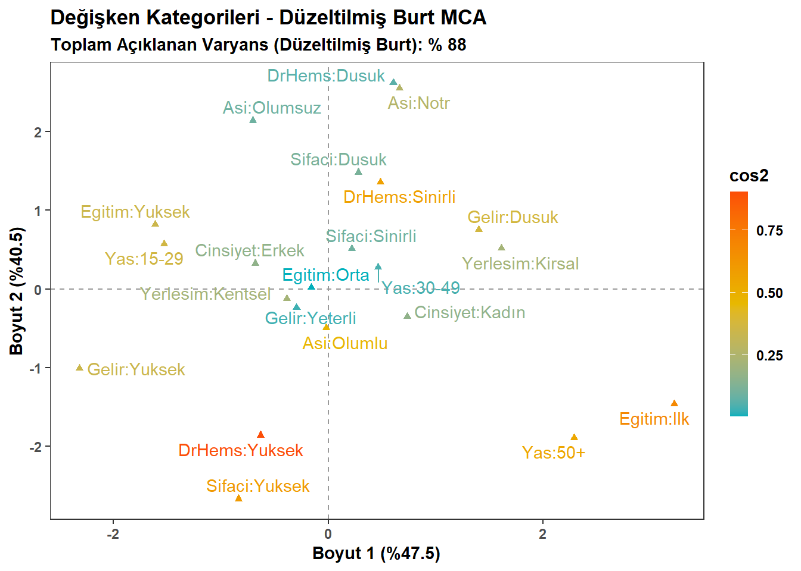
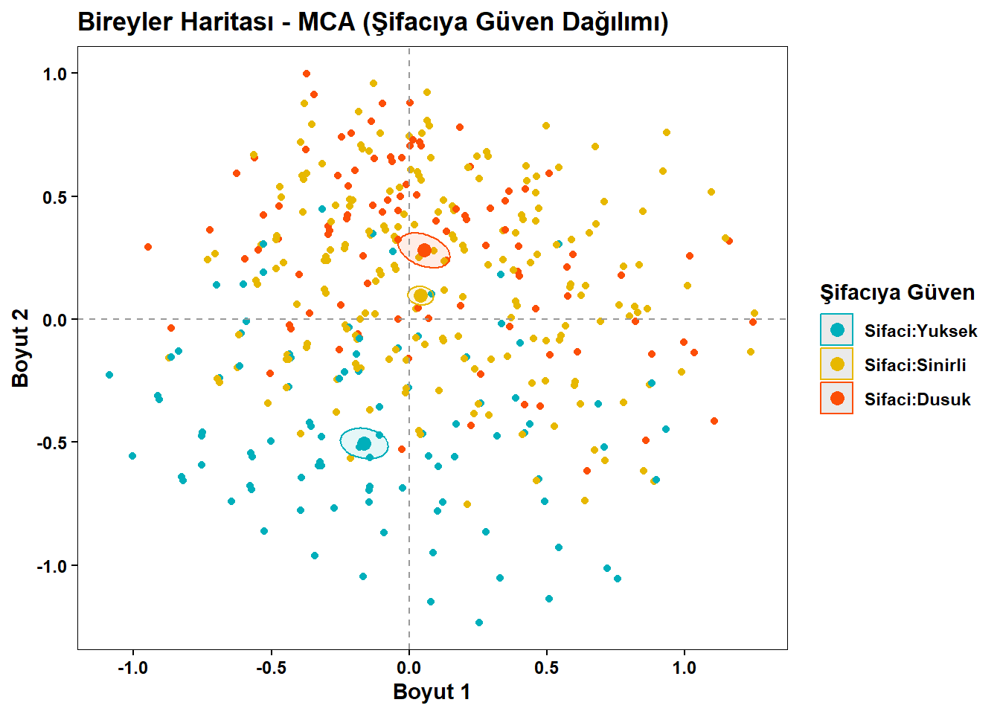

# Statistical Analysis of Public Trust in Traditional & Complementary Medicine in Turkey

An empirical undergraduate research project examining the multidimensional determinants of public trust in traditional and complementary medicine (T&CM) healers in Turkey, utilizing the **Wellcome Global Monitor (WGM)** microdata ($N = 790$).

The study integrates bivariate associations, dimensionality reduction via correspondence analysis, and multivariable probability modeling to test whether trust in traditional healers stems from institutional marginalization ("reaction model") or functions as an integrated wellness preference ("consumption model").

## 🛠️ Tech Stack & Software

- **R & R Markdown:** Multiple Correspondence Analysis (MCA), scree plot construction, variable category dimension contributions, factorial biplots with $cos^2$ representation quality metrics, and 95% confidence ellipses (`FactoMineR`, `factoextra`, `ggplot2`).
- **IBM SPSS Statistics:** Data cleaning, recoding, Chi-square ($\chi^2$) tests of independence, and Multinomial Logistic Regression modeling.

## 📊 Dataset & Sample Architecture

- **Data Source:** Wellcome Global Monitor 2018 (Turkey Subsample).
- **Effective Sample Size ($N$):** 790 adult respondents (cleaned of missing/unresponsive cases).
- **Target Dependent Variable:** Trust in T&CM healers (categorized into *Low: 18.0%*, *Limited: 60.5%*, *High: 21.5%*).
- **Explanatory Dimensions:**
  - *Socio-Demographics:* Gender, age group (15–29, 30–49, 50+), education level (primary, secondary, tertiary), perceived income (low, adequate, high), and residential area (rural, urban).
  - *Health & Institutional Attitudes:* Trust in doctors and nurses (low/limited vs. high) and general attitude toward vaccines (negative, neutral, positive).

## 🔬 Methodological Pipeline & Key Empirical Findings

### 1. Bivariate Analysis ($\chi^2$ Tests of Independence)
- **Institutional Alignment:** Trust in doctors and nurses showed a highly significant positive association with healer trust ($\chi^2 = 69.57, df = 4, p < 0.001$). While 34.4% of respondents with high institutional trust placed high trust in healers, 0.0% of respondents with low institutional trust did so.
- **Economic Gradient:** Perceived income was strongly associated with healer trust ($\chi^2 = 24.66, df = 4, p < 0.001$), with high-income individuals showing more than double the proportion of high healer trust (37.1%) compared to low-income peers (16.8%).
- **Demographic Invariance:** Gender ($p = 0.427$), age ($p = 0.922$), education ($p = 0.554$), residential setting ($p = 0.389$), and vaccine attitudes ($p = 0.069$) exhibited no statistically significant bivariate relationships with healer trust.

### 2. Multiple Correspondence Analysis (MCA) & Matrix Optimization
To resolve the artificial inertia (variance) inflation inherent to standard indicator matrices and classic Burt matrices, a comparative model selection was conducted:
- *Indicator Matrix (Standard MCA):* 21.9% cumulative explained inertia across 2 dimensions.
- *Classic Burt Matrix:* 31.2% cumulative explained inertia.
- *Joint Correspondence Analysis (JCA):* 79.0% cumulative explained inertia.
- **Adjusted Burt Matrix (Optimal):** Achieved **88.0%** cumulative explained inertia across the first two axes (Dimension 1: 47.5%, Dimension 2: 40.5%).
- **Spatial Latent Dimensions:**
  - *Dimension 1 (Socio-Economic Axis):* Heavily structured by primary education, older age (50+), and high income.
  - *Dimension 2 (Institutional Trust Axis):* Dominated by high trust in healers and high trust in doctors/nurses.
  - *Confidence Ellipses:* Non-overlapping 95% concentration ellipses confirmed that high, limited, and low healer trust groups inhabit distinct, statistically separated spatial profiles.

### 3. Multinomial Logistic Regression Modeling
A full multivariable model was fitted with **Low Trust** as the reference category ($\chi^2 = 91.86, df = 22, p < 0.001$; Goodness-of-Fit Pearson $p = 0.250$, Deviance $p = 0.431$; Nagelkerke $R^2 = 0.129$; overall accuracy: 61.6%):
- **High Trust in Doctors/Nurses:** Served as the strongest predictor of high healer trust, exhibiting **4.71 times higher odds** ($Exp(B) = 4.707, 95\% \text{ CI } [2.83, 7.83], p < 0.001$) relative to the low/limited institutional trust group.
- **High Perceived Income:** Exhibited **3.13 times higher odds** ($Exp(B) = 3.134, 95\% \text{ CI } [1.53, 6.43], p = 0.002$) of placing high trust in healers relative to low-income respondents.
- **Non-Significant Sociodemographic Covariates:** When controlling for institutional trust and income, gender ($p = 0.414$), age ($p = 0.997$), education ($p = 0.375$), residence ($p = 0.707$), and vaccine attitudes ($p = 0.375$) exerted no direct, independent effect on placing high trust in healers—refuting traditional sociological assumptions of alternative medicine as a marginal or rural refuge.

## 📈 Visualizations

### 1. Factorial Biplot of Variable Categories
*Two-dimensional projection of socio-demographic and attitudinal categories using Adjusted Burt MCA with $cos^2$ quality grading:*

### 2. Spatial Trust Clusters & 95% Confidence Ellipses
*Separation of participant cohorts across Dimension 1 and Dimension 2 based on healer trust levels:*

## 👤 Author & Contact

- **Yade İrem Bilgiç** – Statistician / Data Analyst
- **Affiliation:** Department of Statistics, Faculty of Science and Letters, Mimar Sinan Fine Arts University
- **Thesis Advisor:** Asst. Prof. Dr. Elif Çoker
- **Email:** yadeirem2004@gmail.com
- **Full Research Paper:** [`Yade_Bilgic_Research_Paper.pdf`](./Yade_Irem_Bilgic_Research_Paper.pdf)
